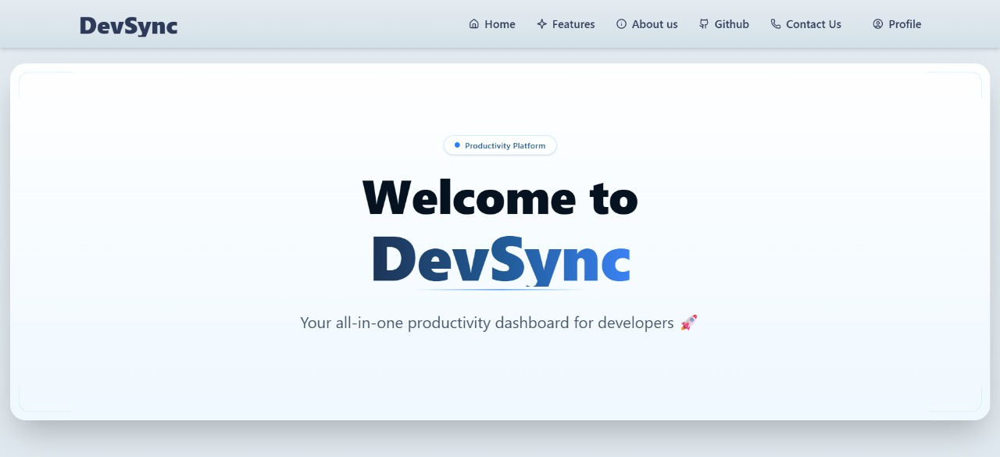
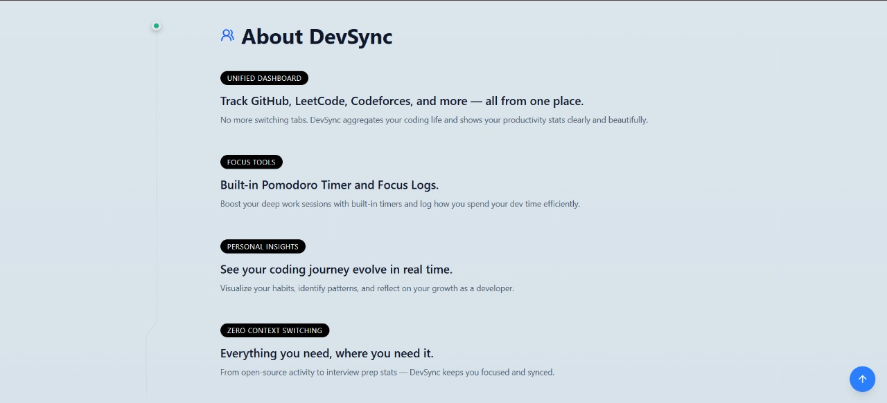
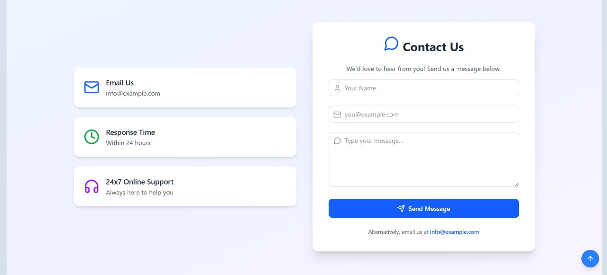

<!-- GSSoC banner and project insights -->
<h1 align="center">
  
  <br>
  DevSync
</h1>


<p align="center">
  <b>This project is now OFFICIALLY accepted for:</b>
</p>

<div align="center">
     

</div>   

<table align="center">
    <thead align="center">
        <tr>
            <td><b>🌟 Stars</b></td>
            <td><b>🍴 Forks</b></td>
            <td><b>🐛 Issues</b></td>
            <td><b>🔔 Open PRs</b></td>
            <td><b>🔕 Closed PRs</b></td>
            <td><b>🛠️ Languages</b></td>
            <td><b>👥 Contributors</b></td>
        </tr>
     </thead>
    <tbody>
         <tr>
            <td></td>
            <td></td>
            <td></td>
            <td></td>
            <td></td>
            <td></td>
            <td></td>
        </tr>
    </tbody>
</table>

# 🚀 DevSync — Developer Productivity Dashboard


From pull requests to pomodoros — DevSync's got you covered.  
Stay ahead. Stay synced. stay **DevSynced**

**DevSync** is a unified productivity tracker for developers. It aggregates your coding activity, daily goals, and contribution metrics from various platforms into a single, elegant dashboard — designed to help you track growth, stay consistent, and showcase your development journey.


## 📋 Table of Contents

- [🔍 Overview](#-overview)
- [✨ Features](#-features)
- [🏗 Tech Stack](#-tech-stack)
- [📸 Screenshots](#-screenshots)
- [📊 Project Insights](#-project-insights)
- [🛠️ Setup & Installation](#️-setup--installation)
- [📁 Folder Structure](#-folder-structure)
- [🤝 Contributing](#-contributing)
- [📜 License](#-license)
- [📄 Code of Conduct](#-code-of-conduct)
- [👩‍💻 Maintainers](#-maintainers)
- [⭐ Support This Project](#-support-this-project)


## 🔍 Overview

In today’s fragmented developer ecosystem, tracking your contributions across multiple platforms can be overwhelming.  
**DevSync** simplifies this by:

- Consolidating your stats, streaks, and growth in one place.  
- Offering visual productivity logs and heatmaps.  
- Letting you manage tasks and goals alongside coding activity.  

Whether you’re preparing for internships, building a personal brand, or staying accountable — **DevSync** empowers you with **data-driven insights** at a glance.  


## ✨ Features

- 📈 **Unified Developer Insights** – Track problems solved, commits, issues, ratings, and more.  
- 🔥 **Cross-Platform Heatmaps** – Visualize your coding streaks and consistency.  
- 🧩 **Modular Platform Support** – Easily add integrations for new coding platforms.  
- ✅ **Task & Goal Tracker** – Stay on top of daily, weekly, and long-term goals.  
- 🧾 **Timeline Logs** – Get auto-generated summaries (daily/weekly/monthly).  
- 🪪 **Public Shareable Profile (Coming Soon)** – Showcase your journey to recruiters or peers.  


## 🏗 Tech Stack

| Layer       | Technology                         |
|-------------|-------------------------------------|
| Frontend    | React, Tailwind CSS, ShadCN UI      |
| Backend     | Node.js, Express, REST API          |
| Database    | MongoDB                             |
| Auth        | JWT / OAuth                         |
| Deployment  | Vercel / Render                     |


## 📸 Screenshots






## 🛠️ Setup & Installation

### 1. Fork the Repository  
Click the **Fork** button (top-right) to get your copy of the repo.

### 2. Clone Your Fork  

```bash
git clone https://github.com/<your-username>/DevSync.git
cd DevSync
````

### 3. Setup Frontend

```bash
cd frontend
npm install
npm run dev
```

Your frontend runs at 👉 [http://localhost:5173](http://localhost:5173)

### 4. Setup Backend

```bash
cd backend
npm install
npm run dev
```

Your backend runs at 👉 [http://localhost:5000](http://localhost:5000)


## 📁 Folder Structure

```
DevSync/
├── frontend/              # Frontend (React + ShadCN UI)
├── backend/               # Backend (Node.js + Express)
├── CONTRIBUTING.md        # Contribution guidelines
├── CODE_OF_CONDUCT.md     # Community rules
├── LICENSE                # MIT License
└── README.md              # Project overview
```


## 🤝 Contributing

We ❤️ contributions!

* Read the [Contributing Guide](./CONTRIBUTING.md).
* Check open issues or raise new ones.
* Submit pull requests with clear descriptions.

Every contribution counts — from bug fixes to new features!


## 📜 License

This project is licensed under the [MIT License](./LICENSE).


## 📄 Code of Conduct

We enforce a [Code of Conduct](./CODE_OF_CONDUCT.md) to maintain a safe, inclusive, and welcoming environment. Please read it before contributing.


## 👩‍💻 Maintainers

* **Annanya Tiwary** – [GitHub](https://github.com/Annanyatiwary4)


## ⭐ Support This Project

If **DevSync** inspired you:

* Star ⭐ the repo on [GitHub](https://github.com/DevSyncx/DevSync)
* Share it with your friends & community
* Contribute by fixing issues or adding features

Together, let’s make developer productivity smarter 🚀
