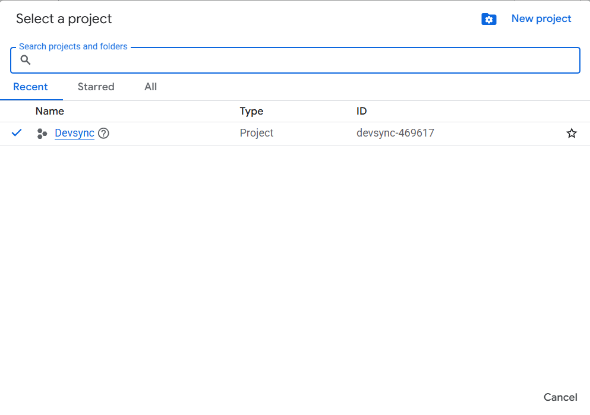
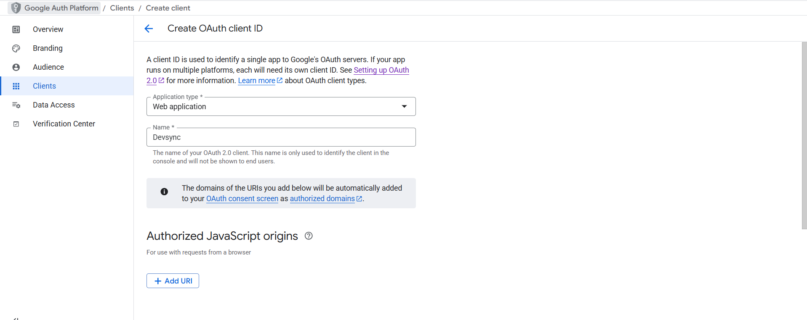
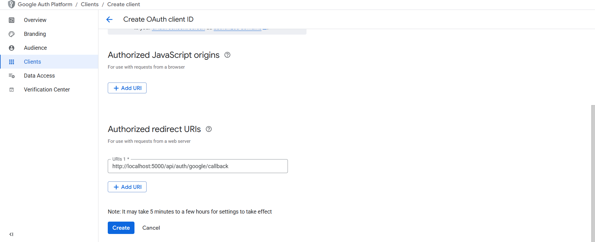

# 🔑 Google OAuth Setup

**Purpose:**  
Enable Google login for the project and allow access to Google APIs securely.

---

## 🚀 Steps

1. **Create a Google Cloud Project**  
   - Go to [Google Cloud Console](https://console.cloud.google.com/).  
   - Click on **“Create Project”** → Give it a name (e.g., `Devsync`).  
   

2. **Enable OAuth 2.0 API**  
   - Navigate to **APIs & Services → Library**.  
   - Search for **“Google Identity Services”** or **“OAuth 2.0 Client IDs”**.  
   - Click **Enable**.

3. **Configure OAuth Consent Screen**  
   - Go to **APIs & Services → OAuth consent screen**.  
   - Select **External** (if this is public) or **Internal** (for organization use).  
   - Fill in:  
     - App Name: `My Project`  
     - User Support Email: `your-email@example.com`  
     - Add Scopes: `email`, `profile`  
  

4. **Create OAuth Credentials**  
   - Go to **APIs & Services → Credentials → Create Credentials → OAuth Client ID**  
   - Application type: **Web Application**
    
   - Add **Redirect URIs**:  
     - `http://localhost:5000/api/auth/callback` (for local dev)  
     - `https://yourdomain.com/auth/callback` (for production)  
   - Click **Create** → Save your `Client ID` and `Client Secret`.
   

5. **Add Environment Variables**  
   - Open `.env` (or create it by copying `.env.example`)  
   - Add the following keys:

```bash
GOOGLE_CLIENT_ID=<your-client-id>
GOOGLE_CLIENT_SECRET=<your-client-secret>
GOOGLE_REDIRECT_URI=http://localhost:5000/api/auth/callback
