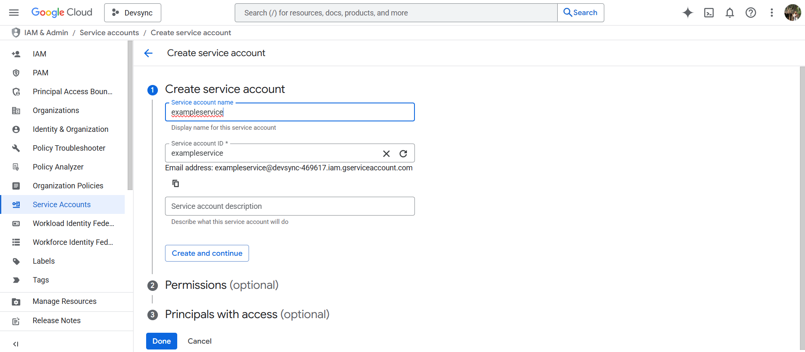
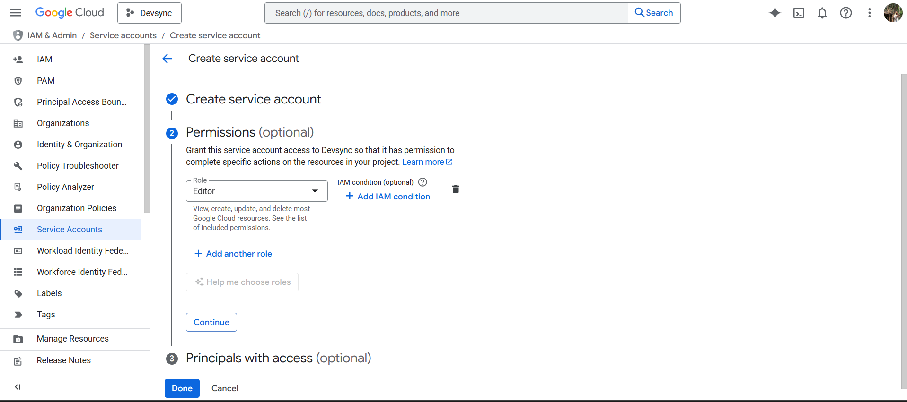
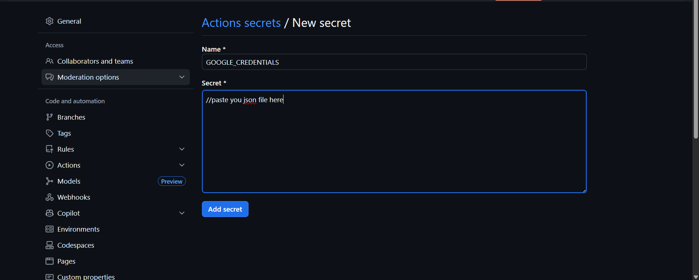

# 📊 GitHub → Google Sheets Action Scripts Setup

**Purpose:**  
Automate updating Google Sheets from GitHub Actions.  
This guide explains the recommended method for setting up credentials and secrets.

---

## 🚀 Steps

1. **Create a Google Cloud Project**  
   - Go to [Google Cloud Console](https://console.cloud.google.com/) and create a new project.  
   - Enable the **Google Sheets API** and **Google Drive API**.
     
2. **Create a Service Account**  
   - Navigate to **IAM & Admin → Service Accounts → Create Service Account**.
   
  
   - Assign **Editor** or appropriate permissions.  
     

3. **Download the Full JSON Credentials**  
   - Click **Keys → Add Key → Create New Key → JSON**.
   - **Important:** Download the **entire JSON file**.  
     > Partial hardcoding (e.g., only client ID or private key) **will not work**.  
   

4. **Share Your Google Sheet with the Service Account**  
   - Open the Google Sheet you want to automate.  
   - Click **Share → Enter the service account email → Give Editor access → Send**.  
   - The **service account email** can be found in the downloaded JSON under `"client_email"`.

5. **Add JSON as GitHub Secret**  
   - Go to **Repository → Settings → Secrets and Variables → Actions → New Repository Secret**.  
   - Upload the **full JSON content** as `GOOGLE_CREDENTIALS`.  
   

6. **Reference Secret in GitHub Action**  
   - Example workflow snippet (`.github/workflows/leaderboard.yml`):

