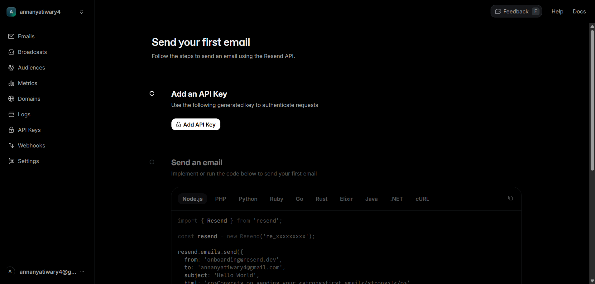
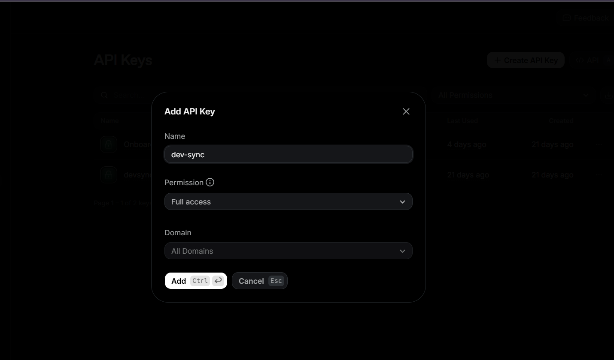
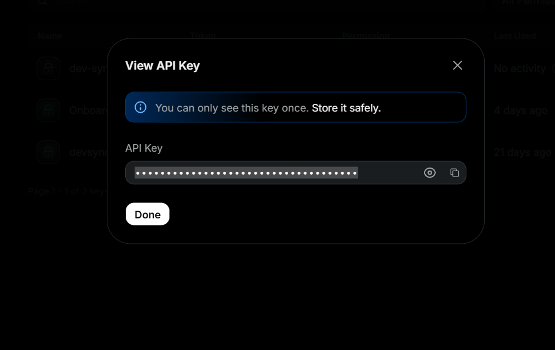

# 📧 Resend API Setup

**Purpose:**  
Enable email sending functionality using Resend API (emails, notifications, etc.) in the project.

---

## 🚀 Steps

1. **Create a Resend Account**  
   - Go to [Resend](https://resend.com/) and sign up.  
   - Verify your email and log in to the dashboard.  
   

2. **Create an API Key**  
   - Navigate to **API Keys → Create Key**.
    
   - Give it a name (e.g., `project-dev-key`) and save it securely.  
   

3. **Add Environment Variables**  
   - Open `.env` (or create one if it doesn’t exist).  
   - Add your Resend API key and sender email:

```bash
RESEND_API_KEY=<your-resend-api-key>       # Must have full access permissions
ADMIN_EMAIL=your-registered-email@example.com  # Must be the same email you registered with on Resend
